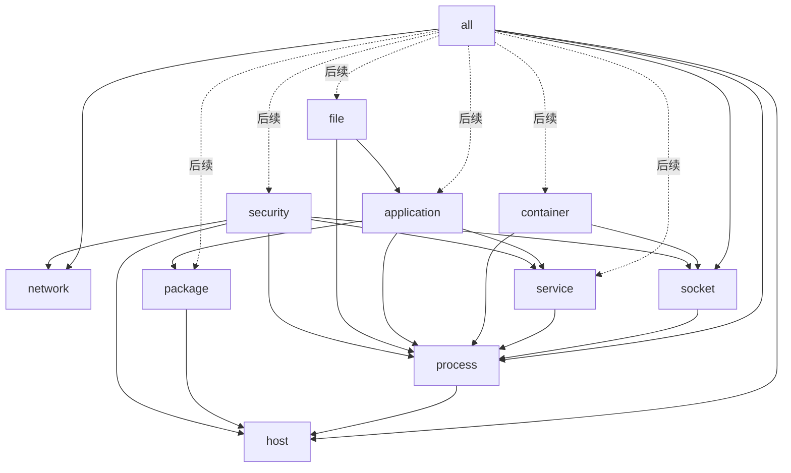

# Linux 资产 Agent 模块化扫描设计

## 1. 目标

将当前只能执行完整扫描的 `asset-agent scan` 改造成类似 nmap 的模块化命令。使用者可以只采集需要的资产域，降低单次扫描耗时和对服务器的负担；未指定输出位置时，报告自动保存到 Agent 安装目录下的 `output` 文件夹。

本次设计解决三个问题：

- 扫描命令短且统一；
- 主机、网络、进程和端口可以独立扫描；
- 默认输出位置固定，同时允许通过 `-o` 或 `--output` 覆盖。

本设计只定义本地 Linux 资产采集行为，不涉及 CMDB、中心端上报、增量调度和历史数据管理。

本设计从 `v0.2.0` 起成为唯一行为基线，不保留 v0.1.0 中“未指定输出参数时向标准输出写 JSON”的默认行为。后续功能继续遵循“具体功能、具体扫描模块”的原则：每个独立资产域拥有自己的命令、数据协议、依赖、状态和测试；`all` 只负责编排模块，不承载新的专用采集逻辑。

## 2. 命令契约

### 2.1 基本命令

```bash
asset-agent scan all
asset-agent scan host
asset-agent scan network
asset-agent scan process
asset-agent scan socket
```

以下命令是 `scan all` 的简写，二者都使用本设计规定的默认文件输出行为：

```bash
asset-agent scan
```

`version` 和 `doctor` 保持原有行为：

```bash
asset-agent version
asset-agent doctor
```

### 2.2 输出参数

短参数和长参数含义相同：

```bash
asset-agent scan host -o /tmp/host.json
asset-agent scan host --output /tmp/host.json
```

输出到标准输出：

```bash
asset-agent scan host -o -
```

参数规则：

- `-o` 和 `--output` 后必须紧跟一个值；
- 一个命令只能出现一次输出参数；
- 输出参数可以放在模块名之后；
- 未知模块、未知参数、缺少输出值或多余位置参数返回退出码 `2`；
- 采集失败或写入失败返回退出码 `1`；
- 成功返回退出码 `0`。

### 2.3 帮助信息

以下命令输出用法，不执行扫描：

```bash
asset-agent help
asset-agent --help
asset-agent scan --help
```

帮助信息列出已经实现的模块和规划模块。规划模块必须明确标记为“尚未实现”。

## 3. 默认输出设计

### 3.1 路径

当 Agent 安装为：

```text
/opt/asset-agent/asset-agent
```

未指定 `-o` 时，报告保存到：

```text
/opt/asset-agent/output/<模块>-<UTC时间>.json
```

示例：

```text
/opt/asset-agent/output/all-20260812T090000Z.json
/opt/asset-agent/output/host-20260812T090100Z.json
/opt/asset-agent/output/network-20260812T090200Z.json
/opt/asset-agent/output/process-20260812T090300Z.json
/opt/asset-agent/output/socket-20260812T090400Z.json
```

“安装目录”定义为当前正在运行的可执行文件经绝对化和符号链接解析后的父目录。不能通过当前工作目录推断安装目录。

若操作系统无法解析可执行文件路径，命令返回错误，不静默改写到当前目录或临时目录。

### 3.2 权限和写入安全

- `output` 目录不存在时自动创建，权限为 `0700`；
- JSON 文件权限为 `0600`；
- 先在目标目录创建临时文件，完成写入和同步后原子重命名；
- 自动生成的文件名包含 UTC 秒级时间；同名时追加短序号，不能覆盖已有报告；
- 用户通过 `-o` 指定文件时，父目录必须已经存在，避免输入错误时意外创建任意目录；
- `-o -` 只写标准输出，不创建默认 `output` 目录；
- 成功写入文件后，在标准输出打印最终绝对路径，便于脚本和人工定位结果。

## 4. 报告协议

### 4.1 完整扫描

`scan all` 使用完整 Snapshot 结构：

```json
{
  "schema_name": "asset-agent.snapshot",
  "schema_version": "1.0",
  "scan": {},
  "agent": {},
  "capabilities": {},
  "host": {},
  "network_interfaces": [],
  "addresses": [],
  "routes": [],
  "processes": [],
  "sockets": [],
  "relationships": [],
  "collector_status": [],
  "resource_usage": {}
}
```

`scan.type` 设置为 `full`。

### 4.2 单模块扫描

单模块使用统一信封，数据放在 `data` 中：

```json
{
  "schema_name": "asset-agent.module-report",
  "schema_version": "1.0",
  "module": "host",
  "scan": {
    "id": "scan-...",
    "type": "module",
    "started_at": "...",
    "finished_at": "...",
    "duration_ms": 12
  },
  "agent": {},
  "data": {},
  "collector_status": [],
  "resource_usage": {}
}
```

约束：

- `schema_name` 唯一标识报告类型；完整扫描和单模块扫描拥有相互独立的协议版本；
- `module` 必须是命令中选择的模块；
- `data` 只暴露该模块约定的业务字段；
- 为建立证据链而执行的内部依赖不把完整结果泄漏到 `data`；
- 内部依赖的状态保留在 `collector_status`，便于解释降级结果；
- 所有集合字段即使为空也输出 `[]`，不输出 `null`；
- 时间统一使用 UTC RFC3339，耗时使用毫秒。

## 5. 当前模块设计

### 5.1 `host` 主机模块

命令：

```bash
asset-agent scan host
```

职责：识别“这台机器是谁”和基础运行环境。

采集内容：

- 主机名；
- Linux 发行版、版本、内核和 CPU 架构；
- Machine ID、Boot ID、DMI UUID；
- 厂商、型号；
- CPU 型号、逻辑 CPU 数量；
- 物理内存总量。

主要数据源：

- `/etc/os-release`；
- `/etc/machine-id`；
- `/proc/sys/kernel/hostname`；
- `/proc/sys/kernel/osrelease`；
- `/proc/cpuinfo`；
- `/proc/meminfo`；
- `/proc/sys/kernel/random/boot_id`；
- `/sys/class/dmi/id/*`。

输出 `data`：

```json
{
  "host": {}
}
```

依赖：无。某些 DMI 文件不可读时输出部分结果，并将状态标记为 `partial` 或 `degraded`。

### 5.2 `network` 网络模块

命令：

```bash
asset-agent scan network
```

职责：描述主机拥有哪些网络接口、IP 地址和路由。

采集内容：

- 接口索引、名称、MTU、MAC 和 Flags；
- IPv4/IPv6 地址及前缀；
- IPv4 路由、网关、Metric 和出口接口；
- Network Namespace 标识；
- DNS 配置摘要，不保存 DNS 文件原文。

主要数据源：

- Go 系统网络接口 API；
- `/sys/class/net`；
- `/proc/net/route`；
- `/proc/self/ns/net`；
- `/etc/resolv.conf` 摘要。

输出 `data`：

```json
{
  "network_interfaces": [],
  "addresses": [],
  "routes": []
}
```

依赖：无。单个接口或路由解析失败不能丢弃其他网络结果。

### 5.3 `process` 进程模块

命令：

```bash
asset-agent scan process
```

职责：建立可稳定关联的运行进程身份，并采集进程运行上下文。

采集内容：

- PID、PPID、进程名和状态；
- UID、GID；
- 启动时钟值；
- 可执行文件、工作目录和 Root 目录；
- 脱敏后的命令行；
- Cgroup；
- Mount、Network 和 PID Namespace。

主要数据源：

- `/proc/<pid>/stat`；
- `/proc/<pid>/status`；
- `/proc/<pid>/cmdline`；
- `/proc/<pid>/exe`、`cwd`、`root`；
- `/proc/<pid>/cgroup`；
- `/proc/<pid>/ns/*`。

输出 `data`：

```json
{
  "processes": []
}
```

内部依赖：轻量读取 Boot ID，用于生成由 Boot ID、PID 和启动时间组成的进程身份。该依赖不输出完整 `host` 对象。

安全要求：不读取进程环境变量；密码、Token、API Key、Authorization 和 URL 凭据必须脱敏。

### 5.4 `socket` 端口与连接模块

命令：

```bash
asset-agent scan socket
```

职责：识别开放端口、当前连接以及它们所属的进程。

采集内容：

- TCP/UDP、IPv4/IPv6；
- 本地地址和端口；
- 远端地址和端口；
- Socket 状态和 inode；
- Network Namespace；
- PID 和稳定进程 ID；
- Socket 到进程的直接证据关系。

主要数据源：

- `/proc/net/tcp`、`tcp6`、`udp`、`udp6`；
- `/proc/<pid>/fd` 中的 `socket:[inode]` 链接；
- `/proc/<pid>` 中建立进程身份所需的最小字段。

输出 `data`：

```json
{
  "sockets": [],
  "relationships": []
}
```

内部依赖：进程模块和轻量 Boot ID。进程详情用于关联但不重复输出到 `data.processes`。

关联规则：只有通过 Network Namespace、Socket inode 和 `/proc/<pid>/fd` 直接匹配得到的关系才标记为 `confidence: "exact"`；不能根据端口名称或进程名称猜测归属。

### 5.5 `all` 完整模块

命令：

```bash
asset-agent scan all
```

职责：通过模块注册表执行当前所有已启用采集模块，生成完整 Snapshot。

当前执行顺序：

```text
capability → host → network → process → socket
```

其中 `host` 为 `process` 提供 Boot ID，`process` 为 `socket` 提供 PID 和稳定进程身份。单个采集器失败只影响自身状态和数据，不能清空其他成功结果。

## 6. 后续模块设计

后续模块先进入注册表和帮助信息；在实现前执行时返回退出码 `2` 和明确的“模块尚未实现”提示，不生成空报告。

### 6.1 `service` 服务模块

目标：把进程归属到操作系统服务。

采集内容：systemd Unit 名称、描述、启停状态、是否开机启动、MainPID、运行用户、ExecStart、Unit 文件路径及服务依赖。主要依据 systemd D-Bus、运行时状态和 Unit 文件；不能仅凭进程名猜测服务。

输出字段：`services`、`relationships`。依赖 `process`。

### 6.2 `package` 软件包模块

目标：识别操作系统安装的软件及版本证据。

采集内容：包名、版本、架构、厂商、包管理器、安装状态和文件归属。直接读取 dpkg、rpm 或 apk 数据库，避免执行外部 Shell。

输出字段：`packages`、`relationships`。依赖 `host` 判断发行版和包管理器。

### 6.3 `container` 容器模块

目标：识别 Docker、containerd 和 CRI 容器，并关联宿主机进程与端口。

采集内容：容器 ID、名称、运行时、镜像、状态、创建时间、入口命令、端口映射、挂载、Namespace 和 Cgroup。优先通过只读 Runtime Socket 获取元数据，以 `/proc` 和 Cgroup 作为交叉证据。

输出字段：`containers`、`relationships`。依赖 `process` 和 `socket`。

### 6.4 `application` 应用识别模块

目标：在进程和服务之上识别业务运行的 Web 服务、中间件、语言运行时、框架与插件。

采集内容：应用类型、产品名、版本、启动入口、配置路径、插件/模块及每项识别证据。识别器必须采用可插拔规则，每个结论记录来源和置信度；未知应用保持未知，不强行归类。

输出字段：`applications`、`relationships`。依赖 `process`、`service`、`package` 和受限的 `file` 读取能力。

### 6.5 `file` 运行文件模块

目标：记录实际运行的二进制、动态库和明确关联的配置文件。

采集内容：路径、类型、大小、权限、属主、修改时间、SHA256、签名信息和来源包。默认只处理由进程、服务或应用发现的文件，不进行全盘遍历。

输出字段：`files`、`relationships`。依赖 `process` 和 `application`。

### 6.6 `security` 安全配置模块

目标：记录影响暴露面和运行防护的主机安全事实。

采集内容：SELinux、AppArmor、主机防火墙、关键内核安全参数、特权进程和监听地址风险标记。只采集配置与状态，不执行攻击验证，不修改安全策略。

输出字段：`security_controls`、`findings`、`relationships`。依赖 `host`、`network`、`process`、`socket` 和 `service`。

## 7. 模块依赖和执行原则



执行原则：

- 一个具有独立资产语义、数据源或性能成本的功能必须设计为独立扫描模块；
- 新功能不得直接堆叠到 `host`、`network`、`process` 或 `socket` 等无关模块中；
- 每个新模块必须定义模块名、命令、输出数据、直接数据源、内部依赖、降级行为和验收测试；
- `all` 通过模块注册表选择已启用模块并编排执行，本身不读取系统资产数据；
- 用户选择的是输出模块，不需要了解内部依赖；
- 编排器自动计算依赖闭包并按拓扑顺序执行；
- 同一次命令中的依赖只执行一次；
- 内部依赖只采集完成目标模块所需的最小信息；
- 依赖失败时，目标模块尽可能输出未关联的原始事实，并标记 `partial`；
- 每个采集器都有独立超时、panic 隔离和状态记录；
- 当前阶段不并发扫描 `/proc`，避免多个模块同时遍历进程造成额外负担。

## 8. 代码结构设计

计划在现有结构上增加以下边界：

```text
internal/cli/
  run.go              命令分派
  scan_options.go     模块名和 -o/--output 参数解析
  output.go           默认目录、文件名和成功路径提示

internal/agent/
  runtime.go          暴露 ScanModule 接口
  scan.go             完整扫描编排
  module.go           单模块编排、依赖和报告信封

internal/model/
  model.go            现有完整 Snapshot
  module_report.go    单模块报告及各模块 data 类型

internal/report/
  json.go             JSON 原子写入
  path.go             安装目录解析、默认路径和防覆盖命名
```

运行时接口调整为：

```go
type Runtime interface {
    Doctor(context.Context) (model.DoctorReport, error)
    Scan(context.Context) (model.Snapshot, error)
    ScanModule(context.Context, string) (model.ModuleReport, error)
}
```

CLI 只负责解析命令和决定输出位置，不了解采集器依赖；Agent 编排层负责模块执行和报告构建；Report 层负责路径与安全写入。

## 9. 错误和降级设计

- 命令输入错误：退出码 `2`，只写 stderr；
- 未实现模块：退出码 `2`，列出当前可用模块；
- 无法定位安装目录：退出码 `1`；
- 默认输出目录创建失败：退出码 `1`，不得回退到不明确的位置；
- 用户指定的父目录不存在或不可写：退出码 `1`；
- 顶层 context 取消：退出码 `1`，不发布不完整报告；
- 单个采集器错误：写入报告并记录 `partial`、`degraded`、`failed` 或 `timeout`；
- `socket` 无法读取部分 PID 的 fd：保留 Socket 事实，缺失的进程关系不标记为 exact；
- 写入失败：删除临时文件，不覆盖上一个成功报告。

## 10. 性能和安全约束

- 所有采集操作只读；
- 不调用 Shell，不通过命令行执行 `ss`、`ps`、`systemctl` 或包管理器；
- 不读取进程环境变量；
- 默认不扫描整个文件系统；
- 进程和 fd 遍历只在依赖需要时发生，并在一次命令中复用；
- 保留现有 15 秒轻量采集器和 30 秒进程/Socket 采集器超时边界；
- 报告默认只允许当前执行用户读写；
- 报告中不写入原始密钥、密码、Token 或 URL 凭据；
- 单模块输出不附带与用户选择无关的完整依赖数据，减少敏感信息面和文件体积。

## 11. 测试设计

### 11.1 CLI 单元测试

- `scan` 和 `scan all` 都调用完整扫描；
- `scan host/network/process/socket` 调用对应模块；
- `-o` 与 `--output` 写入指定文件；
- `-o -` 输出标准输出且不创建目录；
- 默认输出写入可执行文件目录下的 `output`；
- 成功后标准输出包含最终文件绝对路径；
- 未知模块、未知选项、缺少值和重复输出参数返回退出码 `2`；
- `version` 和 `doctor` 行为不回归；
- `scan --output <path>` 继续可用，但无参数 `scan` 的默认输出按 v0.2.0 设计改为安装目录下的文件。

### 11.2 编排单元测试

- 每个模块只公开自己的数据字段；
- `process` 自动获取 Boot ID；
- `socket` 自动执行最小进程依赖并形成 exact 关系；
- 依赖只执行一次；
- 依赖失败时目标模块保留可用事实并正确降级；
- panic、超时和 context 取消符合既有隔离语义；
- 所有集合序列化为 `[]`。

### 11.3 报告和路径测试

- 解析可执行文件真实父目录；
- 自动创建 `output` 且权限为 `0700`；
- 报告权限为 `0600`；
- 同秒同模块执行不会覆盖已有文件；
- 用户指定父目录不存在时失败；
- 原子写入失败时不留下最终半文件。

### 11.4 Linux 验收测试

```bash
sudo ./asset-agent scan host
sudo ./asset-agent scan network
sudo ./asset-agent scan process
sudo ./asset-agent scan socket
sudo ./asset-agent scan all
sudo ./asset-agent scan socket -o /tmp/socket.json
sudo ./asset-agent scan network -o - | jq .
```

验收时将 `socket` 结果与 `ss -lntup` 对照，将 `process` 结果与 `/proc` 对照，并确认默认报告确实位于二进制同级 `output` 目录。

## 12. 本次实现范围

本次实现：

- `host`、`network`、`process`、`socket`、`all`；
- `-o`、`--output` 和默认安装目录输出；
- 统一单模块报告；
- 帮助信息；
- 对未实现模块的明确提示；
- 单元测试、Linux 构建验证、README、验证脚本和代码阅读地图更新。

本次不实现：

- `service`、`package`、`container`、`application`、`file`、`security` 的实际采集器；
- watch 常驻模式；
- 3 天增量和每周全量调度；
- 中心端上传、CMDB 对接；
- 报告保留周期和历史轮转。

后续采集模块按 `service → package → container → application → file → security` 的顺序独立设计和实现。

## 13. 版本基线

- 产品版本：`v0.2.0`；
- `asset-agent scan` 与 `asset-agent scan all` 默认写入安装目录下的 `output`；
- 需要标准输出时必须显式使用 `-o -`；
- 完整报告使用 `schema_name: "asset-agent.snapshot"`；
- 单模块报告使用 `schema_name: "asset-agent.module-report"`；
- v0.1.0 只作为历史 PoC，不再约束后续 CLI 默认行为；
- 后续所有新采集能力均先形成独立模块设计，再进入实现和 `all` 编排。
