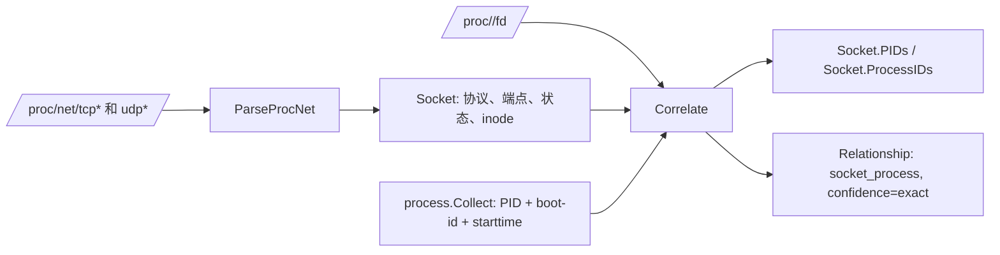

# Asset Agent 代码阅读地图

## 系统画像与策略链路

```text
Scan / ScanModule
  → invokeDoctor
  → capability.Detect（生成 SystemProfile）
  → selectStrategy（核对模块数据源并选择 Backend）
  → invokeHost / invokeNetwork / invokeProcesses / invokeSockets
  → applyStrategyEvidence（写入后端与降级原因）
  → Snapshot / ModuleReport
  → JSON 报告
```

- `internal/capability/detect.go`：`Detect` 读取固定 Linux 事实路径，构建系统画像和 `available_sources`。
- `internal/agent/strategy.go`：`selectStrategy`、`newStrategy`、`markUnavailable`、`canExecuteStrategy`、`applyStrategyEvidence`、`skippedCollectorStatus` 负责策略选择、跳过判断和审计证据。
- `internal/agent/module.go`：`ScanModule` 在任何模块采集器之前只调用一次画像，并只执行策略允许的模块。
- `internal/agent/scan.go`：`Scan` 对四个当前模块生成独立策略，缺少硬性来源的域单独跳过，其他域继续执行。
- `internal/model/model.go`：`SystemProfile`、`CollectionStrategy`、`CollectorStatus.Backend` 定义报告协议。
- `internal/model/module_report.go`：将画像和策略写入单模块报告，并保证数组字段不会输出为 `null`。

> v0.2.0 增加模块化入口：`scan host`、`scan network`、`scan process`、`scan socket` 和 `scan all`。未指定 `-o` 时，报告写入可执行文件同级的 `output`；`-o -` 才写标准输出。

## v0.2.0 模块化新增文件

- `internal/cli/scan_options.go`：解析模块名以及 `-o/--output`；
- `internal/cli/output.go`：选择默认输出或标准输出，并打印最终报告路径；
- `internal/agent/module.go`：执行单模块和必要的最小内部依赖；
- `internal/model/module_report.go`：定义单模块报告信封和模块数据；
- `internal/report/path.go`：解析安装目录、创建私有 `output` 并生成防覆盖文件名。

调用关系：

```text
main
  → cli.Run
    → parseScanOptions
    → Runtime.Scan / Runtime.ScanModule
      → host / network / process / socket 采集器
    → DefaultOutputPath
    → WriteJSONFile / WriteJSON
```

`all` 只编排已经实现的模块；后续每项独立资产能力继续新增独立扫描模块。

本文覆盖当前“基础采集版”实现，不包含尚未实现的 `watch`、72 小时增量/168 小时全量调度、systemd/软件包/容器归属、运行文件哈希、Nginx 深采、状态保留和轮转。

## 1. 先看什么

建议按下面顺序阅读：

1. `cmd/asset-agent/main.go`：程序从这里启动；
2. `internal/cli/run.go`：理解命令行 `version`、`doctor`、`scan`；
3. `internal/agent/runtime.go`、`local_runtime.go`、`scan.go`：理解运行时抽象、采集编排、超时和故障隔离；
4. `internal/model/model.go`：理解所有 JSON 对象、状态和关系字段；
5. `internal/capability/`、`internal/collect/`：理解每个资产域如何从 Linux 事实文件中采集；
6. `internal/platform/files.go`、`internal/security/redact.go`、`internal/report/json.go`：理解安全读取、脱敏和输出；
7. 对应的 `*_test.go`：理解每项行为的可验证边界。

## 2. 总体调用层级

```mermaid
flowchart TD
    M[cmd/asset-agent/main.go] --> R[newRuntime]
    R -->|Linux| LR[agent.NewLocalRuntime('/')]
    R -->|非 Linux| UR[agent.UnavailableRuntime]
    M --> C[cli.Run]
    C -->|version| BI[buildinfo + report.WriteJSON]
    C -->|doctor| D[LocalRuntime.Doctor]
    C -->|scan| S[LocalRuntime.Scan]
    D --> CAP[capability.Detect]
    S --> CAP
    S --> H[host.Collect]
    S --> N[network.Collect]
    S --> P[process.Collect]
    S --> SO[socket.Collect]
    H --> PR[platform.Root]
    N --> PR
    P --> PR
    SO --> PR
    P --> RED[security.RedactArgs]
    SO --> COR[socket.Correlate]
    C --> REP[report.WriteJSON / WriteJSONFile]
    CAP --> MOD[model]
    H --> MOD
    N --> MOD
    P --> MOD
    SO --> MOD
    S --> MOD
```

调用方向始终由上向下：`cmd` 只依赖 `cli`；`cli` 依赖 `agent` 与 `report`；`agent` 组合采集器；采集器依赖 `platform`、`security` 和 `model`；`model` 不依赖任何业务包。这样使采集逻辑不依赖 CMDB 或任何下游系统。

## 3. 核心数据链：端口如何关联到进程



`socket.Correlate` 只接受严格形如 `socket:[12345]` 的文件描述符链接；不会根据端口号、进程名或路径猜测归属。因此 `relationships` 的 `exact` 表示有内核暴露的直接证据。

## 4. 包与文件职责

| 层 | 文件 | 包含的主要类型/函数 | 任务与直接依赖 |
|---|---|---|---|
| 启动 | `cmd/asset-agent/main.go` | `main` | 创建 context、标准输入输出并调用 `cli.Run`。 |
| 启动 | `cmd/asset-agent/runtime_linux.go` | `newRuntime` | Linux 构建时创建以 `/` 为根的 `LocalRuntime`。依赖 `agent`、`platform`。 |
| 启动 | `cmd/asset-agent/runtime_unsupported.go` | `newRuntime` | 非 Linux 构建时提供 `UnavailableRuntime`，避免误把 Windows 当采集目标。 |
| CLI | `internal/cli/run.go` | `Run`、`runScan` | 解析命令和 `scan --output`，调用 Runtime，再交给 report 写 JSON。 |
| 编排 | `internal/agent/runtime.go` | `Runtime` | 定义 CLI 所需的最小接口：`Doctor`、`Scan`。 |
| 编排 | `internal/agent/local_runtime.go` | `LocalRuntime`、`NewLocalRuntime`、`Doctor`、`UnavailableRuntime` | 将真实 Linux 根目录与可替换的采集依赖绑定；非 Linux 返回明确错误。 |
| 编排 | `internal/agent/scan.go` | `Dependencies`、`defaultDependencies`、`Scan`、`invoke*` | 按能力、主机、网络、进程、Socket 的顺序编排，设置 15/30 秒超时，捕获 collector panic，并汇总 `Snapshot`。 |
| 模型 | `internal/model/model.go` | `Status`、`Snapshot`、`Host`、`Process`、`Socket`、`Relationship` 等 | 定义 JSON 协议与采集状态；`Snapshot.MarshalJSON` 统一把 nil slice 写成 `[]`。 |
| 能力 | `internal/capability/detect.go` | `Detect`、`securityModuleCapability`、`socketCapability` | 只读检测 OS、root、proc/sys、init、cgroup、安全模块和运行时 socket；明确报告降级能力。 |
| 能力 | `internal/capability/parse.go` | `SelfStatus`、`ParseOSRelease`、`ParseSelfStatus` | 解析 `/etc/os-release`、`/proc/self/status`，保持纯函数，便于 fixture 测试。 |
| 主机 | `internal/collect/host/collector.go` | `Collect` | 读取 OS、内核、机器/启动标识、DMI、CPU、内存；可选字段缺失时返回 `partial`。 |
| 主机 | `internal/collect/host/parse.go` | `ParseMemoryBytes`、`ParseCPUModel` | 解析 `/proc/meminfo` 与 `/proc/cpuinfo`。 |
| 网络 | `internal/collect/network/collector.go` | `InterfaceSource`、`SystemInterfaceSource`、`Collect` | 用标准库获取网卡/IP；解析 IPv4 路由；对 resolv.conf 只输出摘要哈希。 |
| 网络 | `internal/collect/network/routes.go` | `ParseIPv4Routes`、`parseLinuxIPv4Hex` | 解析 `/proc/net/route` 的小端十六进制 IPv4 地址。 |
| 进程 | `internal/collect/process/collector.go` | `Collect`、`collectPID`、`finishStatus` | 遍历数值 PID，读取受限的 stat/status/cmdline/cgroup 与固定链接；不读取 `environ`。 |
| 进程 | `internal/collect/process/parse.go` | `Stat`、`ParseStat`、`ParseCmdline`、`ParseIDs` | 解析包含括号/空格的 stat、NUL 分隔 cmdline、UID/GID。 |
| Socket | `internal/collect/socket/collector.go` | `Collect`、`finish` | 读取 tcp/tcp6/udp/udp6，记录 `/proc/net` 为降级来源，并调用关联器。 |
| Socket | `internal/collect/socket/parse.go` | `ParseProcNet`、`parseEndpoint`、`socketState` | 规范化端点、小端地址、TCP/UDP 状态和 inode。 |
| Socket | `internal/collect/socket/correlate.go` | `FDSource`、`Correlate`、`parseSocketLink` | 从 `/proc/<pid>/fd` 解析 inode，建立 Socket 到进程的精确关系。 |
| 基础设施 | `internal/platform/files.go` | `Root`、`NewRoot`、`Path`、`ReadFile`、`ReadDir`、`Readlink`、`Stat` | 将 Linux 绝对路径限制在指定采集根下，统一只读和大小上限；生产根为 `/`，测试根为临时目录。 |
| 安全 | `internal/security/redact.go` | `RedactArgs`、`isSensitiveKey` | 脱敏命令行中密码、Token、Authorization、API key 与 URL 用户信息。 |
| 输出 | `internal/report/json.go` | `WriteJSON`、`WriteJSONFile` | 输出不转义 HTML 的 JSON；文件输出使用同目录临时文件、`0600`、同步和 rename。 |
| 构建信息 | `internal/buildinfo/version.go` | `Version`、`Commit`、`BuildTime` | 接收 linker 注入的构建元数据；未注入时使用开发默认值。 |

## 5. 运行时调用关系

### `version`

`main → newRuntime → cli.Run → report.WriteJSON`。虽然先创建 Runtime，但 `version` 不调用任何 Linux 采集器，只输出构建信息。

### `doctor`

`main → cli.Run → LocalRuntime.Doctor → capability.Detect → platform.Root.ReadFile/Stat → DoctorReport → report.WriteJSON`。

`Detect` 缺少单项事实文件时用 `unsupported` 或 `degraded` 表达，而不是让整个 doctor 失败。

### `scan`

`main → cli.Run → runScan → LocalRuntime.Scan`，随后按顺序：

1. `invokeDoctor`：写入 `capabilities`；
2. `invokeHost`：写入 `host`，提供 `boot_id`；
3. `invokeNetwork`：写入接口、IP、路由；
4. `invokeProcesses`：以 boot-id 组成进程稳定 ID；
5. `invokeSockets`：解析 Socket 并使用上述进程建立关系；
6. 计算扫描耗时与 Go 堆内存指标；
7. `report.WriteJSON` 或 `report.WriteJSONFile` 输出。

`invoke*` 是故障边界：它们给采集器设置 timeout、recover panic、补全 `CollectorStatus`。因此一个域失败不会让其他域消失。

## 6. 依赖规则与安全边界

- `model` 仅定义数据，不能导入采集器；
- `platform.Root` 是所有文件读取的安全入口：只接受 Linux 绝对路径，拒绝越过采集根；
- 采集器仅读取 `/etc`、`/proc`、`/sys` 的固定事实路径；没有 Shell 命令执行；
- `process.Collect` 不读取 `/proc/<pid>/environ`；`security.RedactArgs` 在写出 command line 前处理敏感值；
- `network.Collect` 不输出 resolv.conf 原文，仅输出 SHA-256；
- `report.WriteJSONFile` 只清理自己创建的临时文件，目标文件由 rename 原子发布；
- 没有任何包依赖 CMDB、HTTP 客户端、消息队列或远程控制代码。

## 7. 测试文件地图

| 测试文件 | 保护的行为 |
|---|---|
| `internal/cli/run_test.go` | 命令路由、退出码、`--output`、JSON 数组非 null。 |
| `internal/agent/scan_test.go` | Socket 域失败不影响 Host；取消 context 不启动扫描。 |
| `internal/capability/parse_test.go`、`detect_test.go` | os-release/status 解析与能力降级。 |
| `internal/collect/host/parse_test.go` | 内存 KiB 换算、x86/ARM CPU 模型。 |
| `internal/collect/network/routes_test.go` | `/proc/net/route` 小端 IPv4 转换。 |
| `internal/collect/process/parse_test.go` | 含括号进程名、截断 stat、NUL 参数。 |
| `internal/collect/socket/parse_test.go`、`correlate_test.go` | IPv4/IPv6 Socket、状态、畸形行、共享 inode 到多 PID。 |
| `internal/platform/files_test.go` | 采集根为 `/` 时合法 Linux 路径不被误判为越界。 |
| `internal/report/json_test.go` | JSON 可读性、末尾换行、原子文件输出和临时文件清理。 |
| `internal/security/redact_test.go` | 密钥、Token、Authorization、URL 凭据脱敏且不修改输入。 |

## 8. 快速定位问题

- 命令参数或退出码问题：从 `internal/cli/run.go` 开始；
- JSON 字段缺失、出现 `null`：查看 `internal/model/model.go` 的 `Snapshot.MarshalJSON`；
- `doctor` 能力状态异常：查看 `internal/capability/detect.go`；
- 主机/IP/路由不准确：分别查看 `host`、`network` 采集器和对应 parser；
- 端口没有 PID：先看 `socket/parse.go` 是否采到 inode，再看 `correlate.go` 是否能读取 `/proc/<pid>/fd`；
- 进程参数仍有敏感值：查看 `security.RedactArgs`；
- 单个采集域导致整轮失败：查看 `agent/scan.go` 的 `invoke*` 和 `CollectorStatus`。
